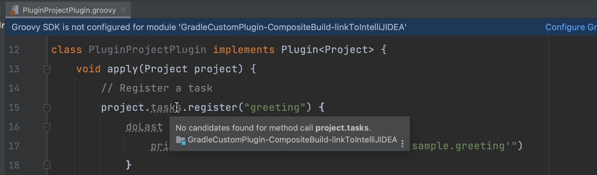
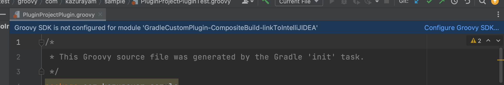
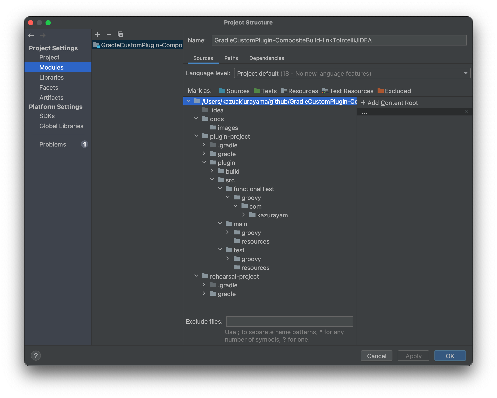
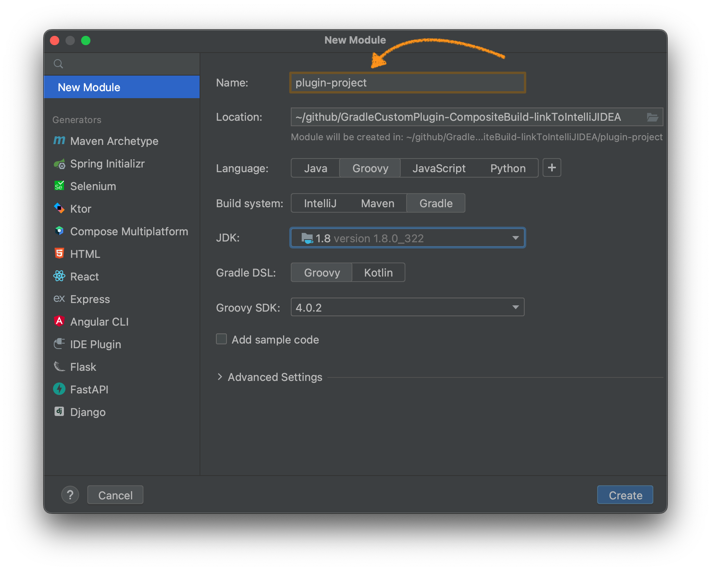
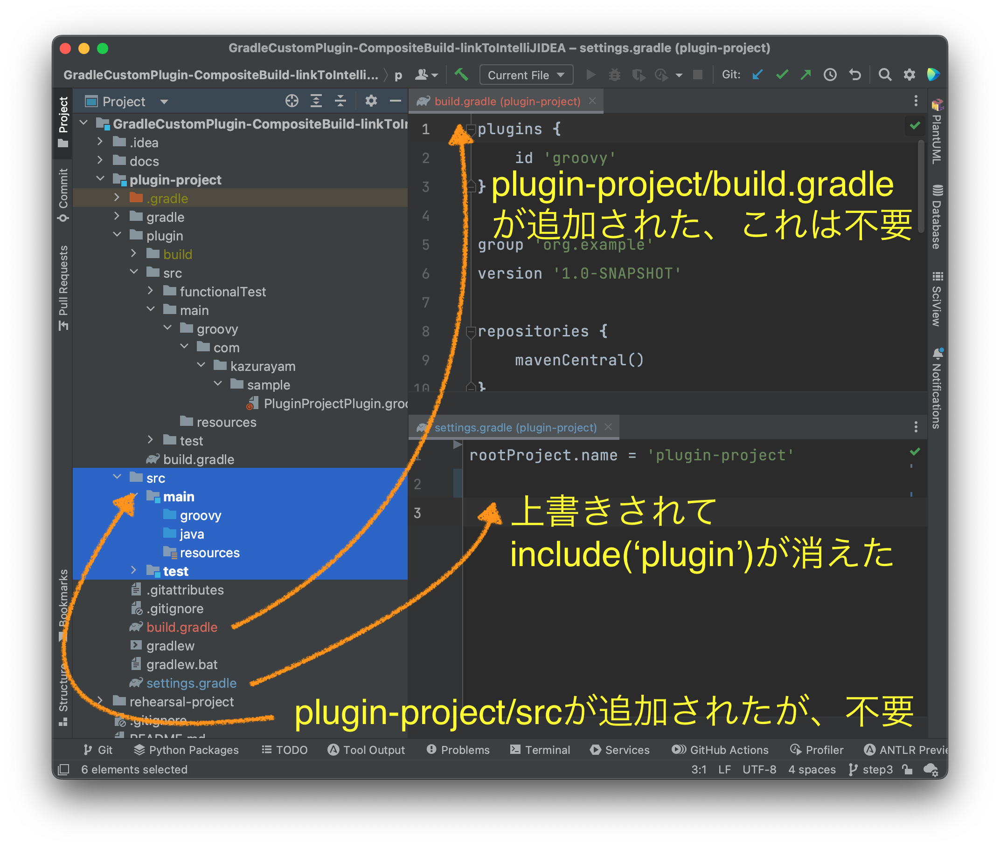

[レポジトリのtopに戻る](https://github.com/kazurayam/GradleCustomPlugin-CompositeBuild-linkToIntelliJIDEA)

# 結論を先に述べる

わたしはカスタムGradleプラグインを開発しようとしてGradleプロジェクトを作った。２つのサブプロジェクトを持つComposite Buildの構成にした。そつなく動作するGradleプロジェクトを作ることができた。これをコマンドラインのbashとテキストエディタで作った。カスタムGradleプラグインのコードを高度なものに発展させたくなったので、IntelliJ IDEAを使いたくなった。GradleプロジェクトをIntelliJ IDEAで開いたがどうもうまくいかなかった。IDEAがクラスパスを正しく認識していない状態に陥って何にもできなかった。どうすればGradleプロジェクトをIDEAにインポートできるのか、よくわからないまま2年経過した。今日、ようやく解決方法がわかった。

教訓：**完全に動作しているGradleプロジェクトをIDEAで開いたら、急がず、焦らず、５０秒ぐらいじっと待て！**

この５０秒間にIDEAはGradleプロジェクトの中にある `build.gradle` ファイルを発見し、内容を解釈して、IDEAモジュールの望ましい設定を自動生成してくれる。IDEAの準備ができたら `Load` ボタンを押せ！するとGradleプロジェクトをうまいこと再構成してIDEAプロジェクトに仕立ててくれる。

# 作業環境

-   macOS 12.6

-   Gradle 7.6

-   IntelliJ IDEA Ultimate 2022.2.1

-   Emacs 28.2

# サンプルコードのありか

下記のURLでサンプルコードを公開しています。

-   <https://github.com/kazurayam/GradleCustomPlugin-CompositeBuild-linkToIntelliJIDEA>

この GitHubレポジトリには ４つのブランチが含まれています。

1.  [ブランチ step1](https://github.com/kazurayam/GradleCustomPlugin-CompositeBuild-linkToIntelliJIDEA/tree/step1)

2.  [ブランチ step2](https://github.com/kazurayam/GradleCustomPlugin-CompositeBuild-linkToIntelliJIDEA/tree/step2)

3.  [ブランチ step3](https://github.com/kazurayam/GradleCustomPlugin-CompositeBuild-linkToIntelliJIDEA/tree/step3)

4.  [ブランチ step4](https://github.com/kazurayam/GradleCustomPlugin-CompositeBuild-linkToIntelliJIDEA/tree/step4)

以下で４つのブランチについて説明します。

# step1

step1では、カスタムGradleプラグインを開発するためのGradleプラグインを一つ作りました。

`<rootDir>/plugin-project` ディレクトリを作ってカスタムGradleプラグインのプロジェクトを作った。`gradle init` コマンドを実行し `4: Gradle Plugin` を選択した。これによってGradleがプラグイン・プロジェクトのサンプル一式を自動生成してくれた。

`GradleCustomPlugin-CompositeBuild-linkToIntelliJIDEA` という名前のディレクトリを作った。これをレポジトリのルートと定めた。

レポジトリのルートディレクトリの直下に `plugin-project` という名前のディレクトリを作った。

    :~/github
    $ mkdir GradleCustomPlugin-CompositeBuild-linkToIntelliJIDEA

    :~/github
    $ cd GradleCustomPlugin-CompositeBuild-linkToIntelliJIDEA

    :~/github/GradleCustomPlugin-CompositeBuild-linkToIntelliJIDEA
    $ cd plugin-project/

次に `plugin-project` ディレクトリの下にGradleプロジェクトを作成した。カスタムGradleプラグインを開発するためのプロジェクトだ。 `gradle init` コマンドを実行して、プロジェクトの雛形を自動生成させた。

    $ baseName `pwd`
    plugin-project

    $ gradle init

    Select type of project to generate:
      1: basic
      2: application
      3: library
      4: Gradle plugin
    Enter selection (default: basic) [1..4] 4

    Select implementation language:
      1: Groovy
      2: Java
      3: Kotlin
    Enter selection (default: Java) [1..3] 1

    Select build script DSL:
      1: Groovy
      2: Kotlin
    Enter selection (default: Groovy) [1..2] 1

    Generate build using new APIs and behavior (some features may change in the next
    Project name (default: plugin-project):
    Source package (default: plugin.project): com.kazurayam.sample

    > Task :init
    Get more help with your project: https://docs.gradle.org/7.6/userguide/custom_plugins.html

    BUILD SUCCESSFUL in 1m 28s
    2 actionable tasks: 2 executed

`gradle init` コマンドがどういうファイル・ツリーを自動生成したのだろうか？ `tree` コマンドで中身を調べた。

    $ basename `pwd`
    GradleCustomPlugin-CompositeBuild-linkToIntelliJIDEA
    :~/github/GradleCustomPlugin-CompositeBuild-linkToIntelliJIDEA (step0 *)
    $ tree .
    .
    ├── README.md
    ...
    └── plugin-project
        ├── gradle
        │   └── wrapper
        │       ├── gradle-wrapper.jar
        │       └── gradle-wrapper.properties
        ├── gradlew
        ├── gradlew.bat
        ├── plugin
        │   ├── build.gradle
        │   └── src
        │       ├── functionalTest
        │       │   └── groovy
        │       │       └── com
        │       │           └── kazurayam
        │       │               └── sample
        │       │                   └── PluginProjectPluginFunctionalTest.groovy
        │       ├── main
        │       │   ├── groovy
        │       │   │   └── com
        │       │   │       └── kazurayam
        │       │   │           └── sample
        │       │   │               └── PluginProjectPlugin.groovy
        │       │   └── resources
        │       └── test
        │           ├── groovy
        │           │   └── com
        │           │       └── kazurayam
        │           │           └── sample
        │           │               └── PluginProjectPluginTest.groovy
        │           └── resources
        └── settings.gradle

    25 directories, 15 files

`<rootDir>/plugin-project` ディレクトリの下に完全なGradleプロジェクトができている。

プロジェクトのルートディレクトリである `<rootDir>/plugin-project` の下に `plugin` ディレクトリが作られていることに注意しよう。その下に `src` ディレクトリがある。

`<rootDir>/plugin-project/settings.gradle` ファイルの中身はこうなっていた。

    rootProject.name = 'plugin-project'
    include('plugin')

ここに `include('plugin')` という行があることに注目しよう。これはGradleの用語でいうところの [マルチプロジェクト](https://docs.gradle.org/current/userguide/multi_project_builds.html#sec:creating_multi_project_builds) である。すなわちプロジェクトのルートディレクトリの下に1個以上（複数可）のサブディレクトリを作り、それぞれの下に `src` ディレクトリを配置する。`plugin-project` プロジェクトはマルチプロジェクトの構成を取りつつも、ここではたまたまサブプロジェクトをひとつ（`plugin`）だけ持っている。

さて、自動生成された `plugin-project` プロジェクトでGradleビルドを実行してみよう。

    $ basename `pwd`
    plugin-project

    $ gradle test

    BUILD SUCCESSFUL in 6s
    6 actionable tasks: 6 executed

`gradle test` コマンドが成功した。それにともなって `<rootDir>/plugin-project/build` ディレクトリが作られ、その下にたくさんのファイルが生成された。実際、どのようなファイルができたかを調べてみた。

    $ baseName `pwd`
    plugin-project

    $ tree .
    .
    ├── gradle
    │   └── wrapper
    │       ├── gradle-wrapper.jar
    │       └── gradle-wrapper.properties
    ├── gradlew
    ├── gradlew.bat
    ├── plugin
    │   ├── build
    │   │   ├── classes
    │   │   │   └── groovy
    │   │   │       ├── main
    │   │   │       │   └── com
    │   │   │       │       └── kazurayam
    │   │   │       │           └── sample
    │   │   │       │               ├── PluginProjectPlugin$_apply_closure1$_closure2.class
    │   │   │       │               ├── PluginProjectPlugin$_apply_closure1.class
    │   │   │       │               └── PluginProjectPlugin.class
    │   │   │       └── test
    │   │   │           └── com
    │   │   │               └── kazurayam
    │   │   │                   └── sample
    │   │   │                       └── PluginProjectPluginTest.class
    │   │   ├── generated
    │   │   │   └── sources
    │   │   │       └── annotationProcessor
    │   │   │           └── groovy
    │   │   │               ├── main
    │   │   │               └── test
    │   │   ├── pluginDescriptors
    │   │   │   └── com.kazurayam.sample.greeting.properties
    │   │   ├── reports
    │   │   │   └── tests
    │   │   │       └── test
    │   │   │           ├── classes
    │   │   │           │   └── com.kazurayam.sample.PluginProjectPluginTest.html
    │   │   │           ├── css
    │   │   │           │   ├── base-style.css
    │   │   │           │   └── style.css
    │   │   │           ├── index.html
    │   │   │           ├── js
    │   │   │           │   └── report.js
    │   │   │           └── packages
    │   │   │               └── com.kazurayam.sample.html
    │   │   ├── resources
    │   │   │   └── main
    │   │   │       └── META-INF
    │   │   │           └── gradle-plugins
    │   │   │               └── com.kazurayam.sample.greeting.properties
    │   │   ├── test-results
    │   │   │   └── test
    │   │   │       ├── TEST-com.kazurayam.sample.PluginProjectPluginTest.xml
    │   │   │       └── binary
    │   │   │           ├── output.bin
    │   │   │           ├── output.bin.idx
    │   │   │           └── results.bin
    │   │   └── tmp
    │   │       ├── compileGroovy
    │   │       │   └── groovy-java-stubs
    │   │       ├── compileTestGroovy
    │   │       │   └── groovy-java-stubs
    │   │       └── test
    │   │           └── work
    │   │               └── gradle4048846890209782351projectDir
    │   │                   └── userHome
    │   │                       └── caches
    │   │                           ├── 7.6
    │   │                           │   ├── fileHashes
    │   │                           │   └── generated-gradle-jars
    │   │                           └── journal-1
    │   │                               └── file-access.properties
    │   ├── build.gradle
    │   └── src
    │       ├── functionalTest
    │       │   └── groovy
    │       │       └── com
    │       │           └── kazurayam
    │       │               └── sample
    │       │                   └── PluginProjectPluginFunctionalTest.groovy
    │       ├── main
    │       │   ├── groovy
    │       │   │   └── com
    │       │   │       └── kazurayam
    │       │   │           └── sample
    │       │   │               └── PluginProjectPlugin.groovy
    │       │   └── resources
    │       └── test
    │           ├── groovy
    │           │   └── com
    │           │       └── kazurayam
    │           │           └── sample
    │           │               └── PluginProjectPluginTest.groovy
    │           └── resources
    └── settings.gradle

    68 directories, 26 files

Gradleビルドがまともに動いていることがわかった。

`gradle init` コマンドが自動生成した [`<rootDir>/plugin-project/plugin/build.gradle`](https://github.com/kazurayam/GradleCustomPlugin-CompositeBuild-linkToIntelliJIDEA/blob/step1/plugin-project/plugin/build.gradle) ファイルには下記のようなコードが書いてる。これによって `check` タスクが定義されている。

    // Add a source set for the functional test suite
    sourceSets {
        functionalTest {
        }
    }

    configurations.functionalTestImplementation.extendsFrom(configurations.testImplementation)

    // Add a task to run the functional tests
    tasks.register('functionalTest', Test) {
        testClassesDirs = sourceSets.functionalTest.output.classesDirs
        classpath = sourceSets.functionalTest.runtimeClasspath
        useJUnitPlatform()
    }

    gradlePlugin.testSourceSets(sourceSets.functionalTest)

    tasks.named('check') {
        // Run the functional tests as part of `check`
        dependsOn(tasks.functionalTest)
    }

`check` タスクは `plugin/src/functionalTest` ディレクトリの下の `src/test` ディレクトリにあるGroovyコードをコンパイルして、できたclassを実行するように宣言されている。実は `` gradle init`コマンドは PluginProjectPluginFunctionalTest.groovy というコードも生成した。このクラスが `gradle check `` によって実行されるわけだ。ではこのGroovyコードは何をしているのだろうか？

FunctionalTestは一時的ディレクトリを作りその中に `build.gradle` ファイルを作る。その中にはこう書いてる。

    plugins {
        id('com.kazurayam.sample.greeting')
    }

つまり `com.kazurayam.sample.greeting` というカスタムGradleプラグインを呼び出す準備をしている。そして `org.gradle.testkit.runner.gradleRunner.GradleRunner` クラスを経由して、カスタムGradleプラグインが提供する `greeting` タスクを実行する。

では `gradle check` タスクを実行してみよう。

    $ baseName `pwd`
    plugin-project

    $ gradle check

    BUILD SUCCESSFUL in 891ms

FunctionalTestのなかでカスタムGradleプラグインが提供する `greeting` タスクが実行されたはずで、`greeting` タスクはSystem.outにテキストをprintしたはずだ。それを目視で確かめたい。System.outを目視するには `plugin-project/plugin/build/reports/tests/functionalTest/classes/com.kazurayam.sample.PluginProjectPluginFunctionalTest.html` ファイルをブラウザで開けば良い。こんなふうにテキストを目視することができた。

`check` タスクが成功した。このように `step1` ブランチに格納されたコード一式は完全に動作するGradleプロジェクトであり、カスタムGradleプラグインを作ることに成功している。

# step2

step2では前述のstep1で開発したカスタムGradleプラグインを実際に利用して動作を確認するために、もう一つのGradleプラグインを作りました。

`<rootDir>/rehearsal-project` ディレクトリを追加してComposite Buildの構成にした。`rehearsal-project/build.gradle` ファイルがカスタムGradleプラグインを呼び出して実行できるようにした。`plugin-project` が開発したカスタムGradleプラグインを **Mavenレポジトリを経由せずに** 直接呼び出す。jarファイルを作ってMavenレポジトリに上げる手間を省くことで、リハーサルすなわち予行演習が素早くできるようにした。

ルートディレクトリ `GradleCustomPlugin-CompositeBuild-linkToIntelliJIDEA` の直下に、`plugin-project` ディレクトリに並ぶ形で `rehearsal-project` ディレクトリを作った。

    $ baseName `pwd`
    GradleCustomPlugin-CompositeBuild-linkToIntelliJIDEA

    $ mkdir rehearsal-project

    $ cd rehearsal-project

    $ baseName `pwd`
    rehearsal-project

そして `cd rehearsal-project` してから `gradle init` コマンドを実行した。basicなGradleプロジェクトを自動生成するためだ。

    $ baseName `pwd`
    rehearsal-project

    $ gradle init

    Select type of project to generate:
      1: basic
      2: application
      3: library
      4: Gradle plugin
    Enter selection (default: basic) [1..4] 1

    Select build script DSL:
      1: Groovy
      2: Kotlin
    Enter selection (default: Groovy) [1..2] 1

    Generate build using new APIs and behavior (some features may change in the next
    Project name (default: rehearsal-project):

    > Task :init
    Get more help with your project: Learn more about Gradle by exploring our samples at https://docs.gradle.org/7.6/samples

    BUILD SUCCESSFUL in 10s
    2 actionable tasks: 2 executed

これによって `rehearsal-project` ディレクトリの下にGradleプロジェクトのコード一式が生成された。

    $ baseName `pwd`
    rehearsal-project

    $ tree .
    .
    ├── build.gradle
    ├── gradle
    │   └── wrapper
    │       ├── gradle-wrapper.jar
    │       └── gradle-wrapper.properties
    ├── gradlew
    ├── gradlew.bat
    └── settings.gradle

    3 directories, 6 files

わたは `rehearsal-project/settings.gradle` ファイルを次のように書き変えた。

    rootProject.name = 'rehearsal-project'

    // include the build of the plugin development project
    includeBuild("../plugin-project") {
        dependencySubstitution {
            // explicitly load the output of the included build
            // into the consumer project's classpath
            substitute(module('com.kazurayam:plugin-project'))
        }
    }

`includeBuild('../plugin-project')` というクロージャー呼び出しに注目してほしい。これがGradleのドキュメントにおいて [Composite Build](https://docs.gradle.org/current/userguide/composite_builds.html) と呼ばれているテクニックだ。これによって `plugin-project` プロジェクトが作成したカスタムGradleプラグインを `rehearsal-project` プロジェクトが直接に参照することができる。

わたしは `rehearsal-project/build.gradle` ファイルを次のように書き換えた。

    plugins {
        id "com.kazurayam.sample.greeting"
    }

つまり `rehearsal-project` のGradleビルドが隣の `plugin-project` のカスタムGradleプラグインを使います、と宣言している。

カスタムGradleプラグインは実行時に `greeting` タスクをビルドに組み込むように作られている。だから実際に動かしてみよう。

    $ baseName `pwd`
    rehearsal-project

    $ gradle greeting

    > Task :greeting
    Hello from plugin 'com.kazurayam.sample.greeting'

    BUILD SUCCESSFUL in 2s
    5 actionable tasks: 2 executed, 3 up-to-date

カスタムGradleプラグインが動いて "Hello from plugin '…​…​'" というメッセージを表示した。成功だ。

このように ブランチ step2 に格納されたコード一式はComposite Build構成のGradleプロジェクトになっていて、完全に動作することを確かめることができた。

以上のコードをわたしはbashシェルとテキストエディタで開発した。必要と感じなかったので、わが愛用のIDE IntelliJ IDEA を使わなかった。

# step3

step2で一つのルートディレクトリの下に２つのGradleプロジェクトを包含するComposite Build構成のディレクトリを作ることに成功した。このファイルツリーをIntelliJ IDEAで開いて、まともなIDEAプロジェクトとして使えるようにしたかった。しかしうまくいかなかった。どのように失敗したかをstep3で説明します。

わたしはIntelliJ IDEAを立ち上げて `GradleCustomPlugin-CompositeBuild-linkToIntelliJIDEA` ディレクトリを開いた。下記のスクリーンショットを参照のこと。

この中には具合の悪いことがたくさんある。かいつまんで指摘してみよう。

IDEAがこういうメッセージを表示した: `Package name mismatch. Actual: 'com.kazurayam.sample', expected: ''`.

このメッセージから、IDEAが `plugin-project` プロジェクトのGroovyソースコードがどのディレクトリに格納されているかを正しく認識していないということがわかる。

またIDEAは次のメッセージを表示した: `No candidates found for method call project.tasks`.

このメッセージに登場した `task.project` という変数はGradle APIの中心である `org.gradle.api.Project` クラスのインスタンスであるべきだ。ところがIDEA(の手下であるGroovyコンパイラ)はこの変数が何なのかわかっていない様子だ。お話にならない。

IDEAは次のメッセージも表示した。`Groovy SDK is not configured for module 'GradleCustomPlugin-CompositeBuild-linkToIntelliJIDEA'`.

何をいっているのか？ コマンドラインで \`plugin-project\`をGradleコマンド問題なくビルドできるのに、なぜIDEAはGroovy SDKがどうのこうのと、ややこしいことを要求するのか？

[IDEAのドキュメント](https://pleiades.io/help/idea/gradle.html)を斜め読みした。IDEAのツールバー Files &gt; Project Structure.. を選ぶと表示されるダイアログ "Project Structure" で Project Settings メニューの中の Modules をなんとかする必要があるらしく思われた。そのダイアログを初めて開いた状態を下記スクリーンショットが示す。

さて、何をどうするべきなのか？step2で完成させたGradleプロジェクトがComposite Build構成とか、マルチプロジェクトとかの技を駆使しているせいで、問題がややこしくなってしまっているらしい。わたしはIDEAを長年使っているがドキュメントをまともに読んだことがない。わたしはIDEAのModuleをどのように構成するべきなのか、さっぱりわからなかった。

しょうがない。当てずっぽうでも何かやってみよう。たぶん `plugin-project` を一つのIDEAモジュールとして認識させることが必要なんだろう。そこで下記のように入力してみた。

その結果、IDEAプロジェクトがぐちゃぐちゃになってしまった。次のスクリーンショットがその様子を示す。

謎がいくつもある。

1.  `plugin-project/settings.gradle` ファイルがIDEAによって上書きされてしまった。 `include('plugin')` の行が無くなった。だからマルチプロジェクトであるはずのプロジェクト構成が壊れてしまった。

2.  `plugin-project/build.gradle` ファイルがIDEAによって追加された。このファイルはまったく不要だ。

3.  `plugin-project/src` ディレクトリとその下に\`src/main/java\` とかのディレクトリがIDEAによって追加された。こいつらも不要だ。

この時点においてもIDEAは `plugin-project` のclasspathを正しく認識できていない。だから珍妙な警告メッセージはそのままで、解消できなかった。IntelliJ IDEAでこのプロジェクトを開発継続することは不可能だ。困り果てた。この問題に遭遇したのが2年前のこと。ずうっと解決できなかった。

# step4

さんざん悩んだあげく、Composite Build構成のGradleプロジェクトをIntelliJ IDEAで開いてまともなIDEAプロジェクトとして使えるように設定することについに成功した。

step2ブランチで作った完成しているGradleプロジェクトをIntelliJ IDEAで開くにはどうすればよいのか？IDEAのドキュメントに何か説明があるんじゃないか？と思った。これかな？

> 1 つの IntelliJ IDEA プロジェクト内に複数の Gradle プロジェクトを含めることができます。コードの一部を別のプロジェクトに保持する場合、作業が必要なレガシープロジェクトがある場合、Gradle コンポジットビルドがある場合、マイクロサービス(英語)で作業する場合に役立つことがあります。このようなプロジェクトを IntelliJ IDEA でリンクし、同時に管理することができます。

おお、これだ。わたしはこれがやりたい。

> IntelliJ IDEA プロジェクトが Gradle プロジェクトにリンクされていない場合、Gradle ツールウィンドウは無効になります。この場合、IntelliJ IDEA は、すぐに Gradle プロジェクトを再インポートして Gradle ツールウィンドウを有効にするリンクを含むメッセージを表示します。

うーん。「メッセージを表示します」と書いてあるが、そんなメッセージ、表示されたっけ？

もう一度試してみよう。\`git checkout step2\`とやって、IDEAでルートディレクトリを開いた。それらしいメッセージが見当たらない。どこにあるのか？しっかり眺めた。やっぱり無いぞ。・・・・

**５０秒間ぐらい放置していた。**

するとIDEAのウインドウがちょっと動いて、画面右側の領域にメッセージが表示された。

*「Gradleのビルド・スクリプトを見つけた」*

*「ロードするかい？」*

と小さな声でIDEAが訊ねている。ああ、これか！ドキュメントは「すぐに表示します」と書いているが、実は５０秒もかかるとは。

Loadボタンを押した。数秒間IDEAが動いて画面がすっかり変化した。

いい感じだ。Projectツリーのなかでプログラムのソースコードが配置されたノードに青い四角いアイコンが表示されている。IDEAがclasspathを正しく認識しているらしい。画面右側にIDEAがGradleプロジェクトをどのように認識しているかが表示されて。そこを見ると `plugin-project` と `rehearsal-project` という2つのGradleプロジェクトが認識されてるのがわかる。IDEAがGradleプロジェクトの中にある `build.gradle` ファイルを発見し、解釈して、それと整合するようにIDEAのモジュールを適切に生成してくれたようだ。

IDEAのProject Structureはこんなふうになっていた。

とくに違和感はない。わたしはIDEAが不勉強なので確たることはいえないが、この設定が望ましいものなのだろう。

やっとカスタムGradleプラグインの開発をIntelliJ IDEAで継続することができるようになった。

# 結論

わたしにとって長い苦難の道のりでした。
