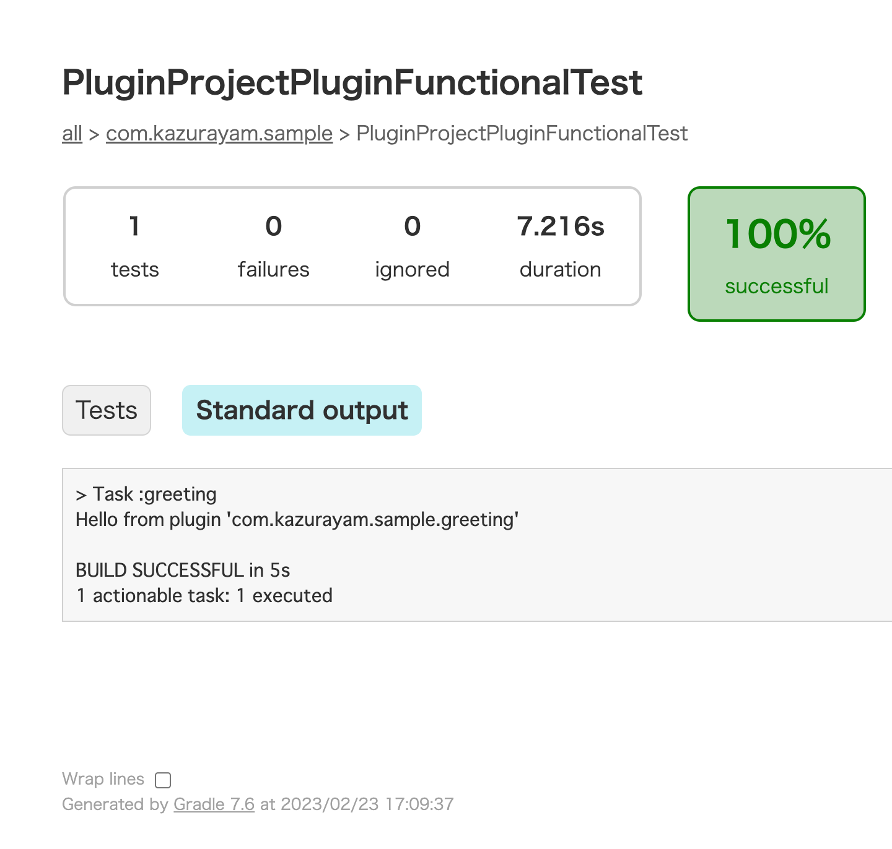

# 作業環境

-   macOS 12.6

-   Gradle 7.6

-   IntelliJ IDEA Ultimate 2022.2.1

-   Emacs 28.2

# Branches

ブランチ step1 と step2 で、カスタムGradleプラグインを開発するためのGradleプロジェクトを作った。プラグイン開発のためのプロジェクトとそれを「リハーサル」する＝予行演習するためのプロジェクトと２つのプロジェクトからなるComposite Buildの構成にすることに成功した。step1とstep2を作るのにわたしは Terminalアプリケーション で bash とEmacsエディタを使い、あえてIntelliJ IDEAを使わなかった。つにぎ step3でGradleプロジェクトをIntelliJ IDEAに取り込むことを試みたができなかった。Composite Build構成のGradleプロジェクトをIntelliJ IDEAに結びつける正しい方法がわからなかった。この疑問に遭遇したのが２年ぐらい前。以来、悪戦苦闘した。そしてついに答えを見つけた。step4で答えを紹介する。

## step1

[ブランチ step1](https://github.com/kazurayam/GradleCustomPlugin-CompositeBuild-linkToIntelliJIDEA/tree/step1)

\`&lt;rootDir&gt;/plugin-project\`ディレクトリを作ってカスタムGradleプラグインのプロジェクトを作った。\`gradle init\`コマンドを実行し\`4: Gradle Plugin\`を選択してサンプルコード一式を自動生成させた。

`GradleCustomPlugin-CompositeBuild-linkToIntelliJIDEA` という名前のディレクトリを作った。これをレポジトリのルートと定めた。

レポジトリのルートディレクトリの直下に `plugin-project` という名前のディレクトリを作った。

    :~/github
    $ mkdir GradleCustomPlugin-CompositeBuild-linkToIntelliJIDEA

    :~/github
    $ cd GradleCustomPlugin-CompositeBuild-linkToIntelliJIDEA

    :~/github/GradleCustomPlugin-CompositeBuild-linkToIntelliJIDEA
    $ cd plugin-project/

次に `plugin-project` ディレクトリの下にGradleプロジェクトを作成した。カスタムGradleプラグインを開発するためのプロジェクトだ。 `gradle init` コマンドを実行して、プロジェクトの雛形を自動生成させた。

    $ baseName `pwd`
    plugin-project

    $ gradle init

    Select type of project to generate:
      1: basic
      2: application
      3: library
      4: Gradle plugin
    Enter selection (default: basic) [1..4] 4

    Select implementation language:
      1: Groovy
      2: Java
      3: Kotlin
    Enter selection (default: Java) [1..3] 1

    Select build script DSL:
      1: Groovy
      2: Kotlin
    Enter selection (default: Groovy) [1..2] 1

    Generate build using new APIs and behavior (some features may change in the next
    Project name (default: plugin-project):
    Source package (default: plugin.project): com.kazurayam.sample

    > Task :init
    Get more help with your project: https://docs.gradle.org/7.6/userguide/custom_plugins.html

    BUILD SUCCESSFUL in 1m 28s
    2 actionable tasks: 2 executed

`gradle init` コマンドがどういうファイル・ツリーを自動生成したのだろうか？ `tree` コマンドで中身を調べた。

    $ basename `pwd`
    GradleCustomPlugin-CompositeBuild-linkToIntelliJIDEA
    :~/github/GradleCustomPlugin-CompositeBuild-linkToIntelliJIDEA (step0 *)
    $ tree .
    .
    ├── README.md
    ...
    └── plugin-project
        ├── gradle
        │   └── wrapper
        │       ├── gradle-wrapper.jar
        │       └── gradle-wrapper.properties
        ├── gradlew
        ├── gradlew.bat
        ├── plugin
        │   ├── build.gradle
        │   └── src
        │       ├── functionalTest
        │       │   └── groovy
        │       │       └── com
        │       │           └── kazurayam
        │       │               └── sample
        │       │                   └── PluginProjectPluginFunctionalTest.groovy
        │       ├── main
        │       │   ├── groovy
        │       │   │   └── com
        │       │   │       └── kazurayam
        │       │   │           └── sample
        │       │   │               └── PluginProjectPlugin.groovy
        │       │   └── resources
        │       └── test
        │           ├── groovy
        │           │   └── com
        │           │       └── kazurayam
        │           │           └── sample
        │           │               └── PluginProjectPluginTest.groovy
        │           └── resources
        └── settings.gradle

    25 directories, 15 files

`<rootDir>/plugin-project` ディレクトリの下に完全なGradleプロジェクトができている。

プロジェクトのルートディレクトリである `<rootDir>/plugin-project` の下に `plugin` ディレクトリが作られていることに注意しよう。その下に `src` ディレクトリがある。

`<rootDir>/plugin-project/settings.gradle` ファイルの中身はこうなっていた。

    rootProject.name = 'plugin-project'
    include('plugin')

ここに `include('plugin')` という行があることに注目しよう。これはGradleの用語でいうところの [マルチプロジェクト](https://docs.gradle.org/current/userguide/multi_project_builds.html#sec:creating_multi_project_builds) である。すなわちプロジェクトのルートディレクトリの下に複数のサブディレクトリを作り、それぞれの下に `src` ディレクトリを配置する。`plugin-project` プロジェクトはマルチプロジェクトの構成を取りつつも、ここではたまたまサブプロジェクトをひとつ（`plugin`）だけ持っている。

さて、自動生成された `plugin-project` プロジェクトでGradleビルドを実行してみよう。

    $ basename `pwd`
    plugin-project

    $ gradle test

    BUILD SUCCESSFUL in 6s
    6 actionable tasks: 6 executed

`gradle test` コマンドが成功した。それにともなって `<rootDir>/plugin-project/build` ディレクトリが作られ、その下にたくさんのファイルが生成された。実際、どのようなファイルができたかを調べてみた。

    $ baseName `pwd`
    plugin-project

    $ tree .
    .
    ├── gradle
    │   └── wrapper
    │       ├── gradle-wrapper.jar
    │       └── gradle-wrapper.properties
    ├── gradlew
    ├── gradlew.bat
    ├── plugin
    │   ├── build
    │   │   ├── classes
    │   │   │   └── groovy
    │   │   │       ├── main
    │   │   │       │   └── com
    │   │   │       │       └── kazurayam
    │   │   │       │           └── sample
    │   │   │       │               ├── PluginProjectPlugin$_apply_closure1$_closure2.class
    │   │   │       │               ├── PluginProjectPlugin$_apply_closure1.class
    │   │   │       │               └── PluginProjectPlugin.class
    │   │   │       └── test
    │   │   │           └── com
    │   │   │               └── kazurayam
    │   │   │                   └── sample
    │   │   │                       └── PluginProjectPluginTest.class
    │   │   ├── generated
    │   │   │   └── sources
    │   │   │       └── annotationProcessor
    │   │   │           └── groovy
    │   │   │               ├── main
    │   │   │               └── test
    │   │   ├── pluginDescriptors
    │   │   │   └── com.kazurayam.sample.greeting.properties
    │   │   ├── reports
    │   │   │   └── tests
    │   │   │       └── test
    │   │   │           ├── classes
    │   │   │           │   └── com.kazurayam.sample.PluginProjectPluginTest.html
    │   │   │           ├── css
    │   │   │           │   ├── base-style.css
    │   │   │           │   └── style.css
    │   │   │           ├── index.html
    │   │   │           ├── js
    │   │   │           │   └── report.js
    │   │   │           └── packages
    │   │   │               └── com.kazurayam.sample.html
    │   │   ├── resources
    │   │   │   └── main
    │   │   │       └── META-INF
    │   │   │           └── gradle-plugins
    │   │   │               └── com.kazurayam.sample.greeting.properties
    │   │   ├── test-results
    │   │   │   └── test
    │   │   │       ├── TEST-com.kazurayam.sample.PluginProjectPluginTest.xml
    │   │   │       └── binary
    │   │   │           ├── output.bin
    │   │   │           ├── output.bin.idx
    │   │   │           └── results.bin
    │   │   └── tmp
    │   │       ├── compileGroovy
    │   │       │   └── groovy-java-stubs
    │   │       ├── compileTestGroovy
    │   │       │   └── groovy-java-stubs
    │   │       └── test
    │   │           └── work
    │   │               └── gradle4048846890209782351projectDir
    │   │                   └── userHome
    │   │                       └── caches
    │   │                           ├── 7.6
    │   │                           │   ├── fileHashes
    │   │                           │   └── generated-gradle-jars
    │   │                           └── journal-1
    │   │                               └── file-access.properties
    │   ├── build.gradle
    │   └── src
    │       ├── functionalTest
    │       │   └── groovy
    │       │       └── com
    │       │           └── kazurayam
    │       │               └── sample
    │       │                   └── PluginProjectPluginFunctionalTest.groovy
    │       ├── main
    │       │   ├── groovy
    │       │   │   └── com
    │       │   │       └── kazurayam
    │       │   │           └── sample
    │       │   │               └── PluginProjectPlugin.groovy
    │       │   └── resources
    │       └── test
    │           ├── groovy
    │           │   └── com
    │           │       └── kazurayam
    │           │           └── sample
    │           │               └── PluginProjectPluginTest.groovy
    │           └── resources
    └── settings.gradle

    68 directories, 26 files

`gradle init` コマンドが自動生成した [`<rootDir>/plugin-project/plugin/build.gradle`](https://github.com/kazurayam/GradleCustomPlugin-CompositeBuild-linkToIntelliJIDEA/blob/step1/plugin-project/plugin/build.gradle) ファイルには下記のようなコードが書いてる。これによって `check` タスクが定義されている。

    // Add a source set for the functional test suite
    sourceSets {
        functionalTest {
        }
    }

    configurations.functionalTestImplementation.extendsFrom(configurations.testImplementation)

    // Add a task to run the functional tests
    tasks.register('functionalTest', Test) {
        testClassesDirs = sourceSets.functionalTest.output.classesDirs
        classpath = sourceSets.functionalTest.runtimeClasspath
        useJUnitPlatform()
    }

    gradlePlugin.testSourceSets(sourceSets.functionalTest)

    tasks.named('check') {
        // Run the functional tests as part of `check`
        dependsOn(tasks.functionalTest)
    }

`check` タスクは `plugin/src/functionalTest` ディレクトリの下の `src/test` ディレクトリにあるGroovyコードをコンパイルして、できたclassを実行するように宣言されている。実は `` gradle init`コマンドは PluginProjectPluginFunctionalTest.groovy というコードも生成した。このクラスが `gradle check `` によって実行されるわけだ。ではこのGroovyコードは何をしているのだろうか？

FunctionalTestは一時的ディレクトリを作りその中に `build.gradle` ファイルを作る。その中にはこう書いてる。

    plugins {
        id('com.kazurayam.sample.greeting')
    }

つまり `com.kazurayam.sample.greeting` というカスタムGradleプラグインを呼び出す準備をしている。そして `org.gradle.testkit.runner.gradleRunner.GradleRunner` クラスを経由して、カスタムGradleプラグインが提供する `greeting` タスクを実行する。

では `gradle check` タスクを実行してみよう。

    $ baseName `pwd`
    plugin-project

    $ gradle check

    BUILD SUCCESSFUL in 891ms

\`check\`タスクが成功した。

FunctionalTestのなかでカスタムGradleプラグインが提供する `greeting` タスクが実行されたはずで、`greeting` タスクはSystem.outにテキストをprintしたはずだ。それを目視で確かめたい。System.outを目視するには `plugin-project/plugin/build/reports/tests/functionalTest/classes/com.kazurayam.sample.PluginProjectPluginFunctionalTest.html` ファイルをブラウザで開けば良い。こんなふうにテキストを目視することができた。

このように `step1` ブランチに格納されたコード一式は完全に動作するGradleプロジェクトであり、カスタムGradleプラグインを作ることに成功している。

## step2

[ブランチ step2](https://github.com/kazurayam/GradleCustomPlugin-CompositeBuild-linkToIntelliJIDEA/tree/step2)

`<rootDir>/rehearsal-project` ディレクトリを追加してComposite Buildの構成にした。`rehearsal-project/build.gradle` ファイルがカスタムGradleプラグインを呼び出して実行できるようにした。`plugin-project` が開発したカスタムGradleプラグインを **Mavenレポジトリを経由せずに** 直接呼び出す。jarファイルを作ってMavenレポジトリに上げる手間を省くことで、リハーサルすなわち予行演習が素早くできるようにした。

ルートディレクトリ `GradleCustomPlugin-CompositeBuild-linkToIntelliJIDEA` の直下に、`plugin-project` ディレクトリに並ぶ形で `rehearsal-project` ディレクトリを作った。

    $ baseName `pwd`
    GradleCustomPlugin-CompositeBuild-linkToIntelliJIDEA

    $ mkdir rehearsal-project

    $ cd rehearsal-project

    $ baseName `pwd`
    rehearsal-project

そして `cd rehearsal-project` してから `gradle init` コマンドを実行した。basicなGradleプロジェクトを自動生成するためだ。

    $ baseName `pwd`
    rehearsal-project

    $ gradle init

    Select type of project to generate:
      1: basic
      2: application
      3: library
      4: Gradle plugin
    Enter selection (default: basic) [1..4] 1

    Select build script DSL:
      1: Groovy
      2: Kotlin
    Enter selection (default: Groovy) [1..2] 1

    Generate build using new APIs and behavior (some features may change in the next
    Project name (default: rehearsal-project):

    > Task :init
    Get more help with your project: Learn more about Gradle by exploring our samples at https://docs.gradle.org/7.6/samples

    BUILD SUCCESSFUL in 10s
    2 actionable tasks: 2 executed

これによって `rehearsal-project` ディレクトリの下にGradleプロジェクトのコード一式が生成された。

    $ baseName `pwd`
    rehearsal-project

    $ tree .
    .
    ├── build.gradle
    ├── gradle
    │   └── wrapper
    │       ├── gradle-wrapper.jar
    │       └── gradle-wrapper.properties
    ├── gradlew
    ├── gradlew.bat
    └── settings.gradle

    3 directories, 6 files

わたは `rehearsal-project/settings.gradle` ファイルを次のように書き変えた。

    rootProject.name = 'rehearsal-project'

    // include the build of the plugin development project
    includeBuild("../plugin-project") {
        dependencySubstitution {
            // explicitly load the output of the included build
            // into the consumer project's classpath
            substitute(module('com.kazurayam:plugin-project'))
        }
    }

`includeBuild('../plugin-project')` というクロージャー呼び出しに注目してほしい。これがGradleのドキュメントにおいて [Composite Build](https://docs.gradle.org/current/userguide/composite_builds.html) と呼ばれているテクニックだ。これによって\`plugin-project\` プロジェクトが作成したカスタムGradleプラグインを `rehearsal-project` プロジェクトが直接に参照することができる。

わたしは `rehearsal-project/build.gradle` ファイルを次のように書き換えた。

    plugins {
        id "com.kazurayam.sample.greeting"
    }

つまり `rehearsal-project` のGradleビルドが隣の `plugin-project` のカスタムGradleプラグインを使います、と宣言している。

カスタムGradleプラグインは実行時に `greeting` タスクをビルドに組み込むように作られている。だから実際に動かしてみよう。

    $ baseName `pwd`
    rehearsal-project

    $ gradle greeting

    > Task :greeting
    Hello from plugin 'com.kazurayam.sample.greeting'

    BUILD SUCCESSFUL in 2s
    5 actionable tasks: 2 executed, 3 up-to-date

カスタムGradleプラグインが動いて "Hello " というメッセージを表示した。成功だ。

このように ブランチ step2 に格納されたコード一式はComposite Build構成のGradleプロジェクトになっていて、完全に動作することを確かめることができた。めでたし、めでたし。

以上のコードをわたしはbashシェルとテキストエディタで開発した。IntelliJ IDEAは使わなかった。次の step3 では step2 で作ったGradleプロジェクトをIntelliJ IDEAで開いて開発できるように設定することを試みた。…​. ところがどっこい、うまくいかなかったんだ、これが。

## step3

GradleプロジェクトをIntelliJ IDEAで開いてコードの開発をしようとしたが、うまくいかなかった。

1.  IDEAの「モジュール」をどう設定すればいいのかわからなかった。IDEAの「モジュール」を作ろうとして色々試みるうちに、IDEAが余計なフォルダを追加したり、\`settings.gradle\`ファイルと\`build.gradle\`ファイルを上書きしたりしたせいで、元のGradleプロジェクトが壊れて動かなくなってしまった。

2.  IDEAがクラスパスを正しく認識できていないので、カスタムGradleプラグインのコードをコンパイルすることすらできない

3.  エディタ画面を右クリックしてJUnit5のテストを実行したいのだが、できなかった

## step4

完成しているGradleプロジェクトをIntelliJ IDEAに取り込むにどうすればいいのか、正しい方法をついに見つけた。build.gradleファイルを右クリックして "link to IntelliJ IDEA" メニューを選択する。
