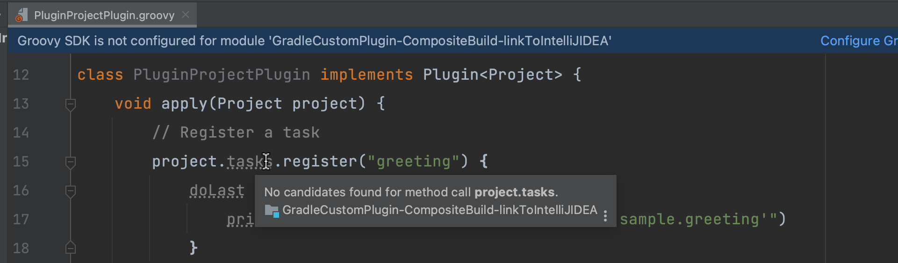
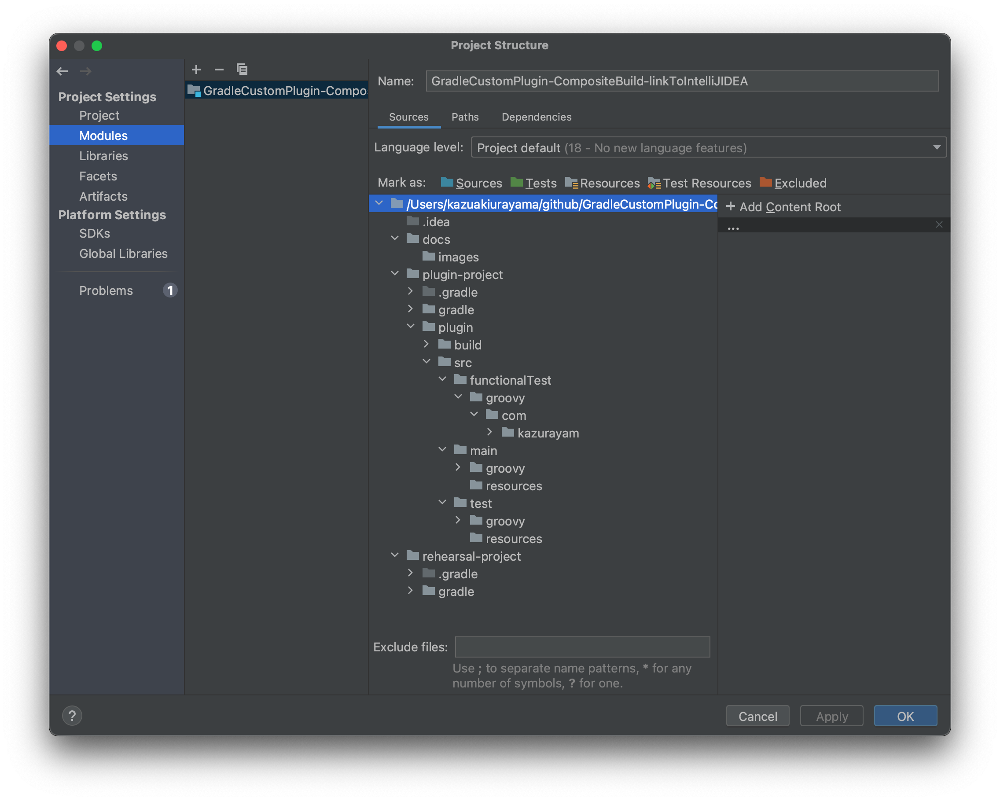
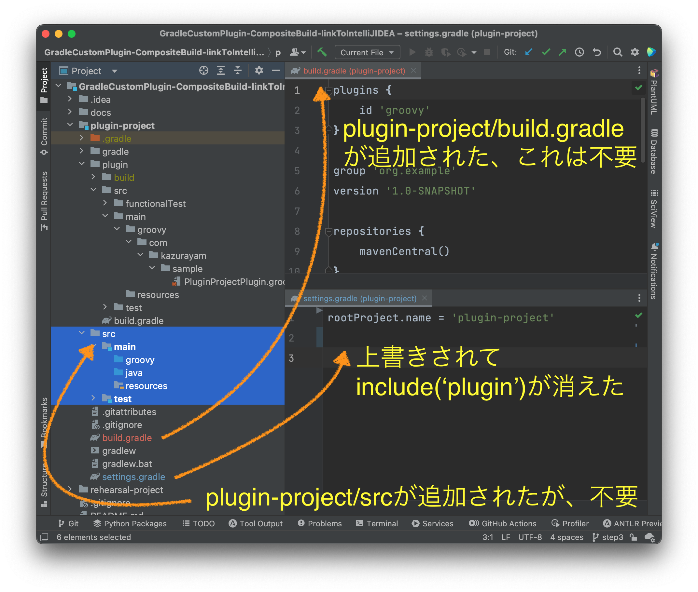

わたしはIntelliJ IDEAを立ち上げて `GradleCustomPlugin-CompositeBuild-linkToIntelliJIDEA` ディレクトリを開いた。下記のスクリーンショットを参照のこと。

この中には具合の悪いことがたくさんある。かいつまんで指摘してみよう。

IDEAがこういうメッセージを表示した: `Package name mismatch. Actual: 'com.kazurayam.sample', expected: ''`.

このメッセージから、IDEAが `plugin-project` プロジェクトのGroovyソースコードがどのディレクトリに格納されているかを正しく認識していないということがわかる。

またIDEAは次のメッセージを表示した: `No candidates found for method call project.tasks`.

このメッセージに登場した `task.project` という変数はGradle APIの中心である `org.gradle.api.Project` クラスのインスタンスだ。ところがIDEA(の手下であるGroovyコンパイラ)はこの変数が何なのかわかっていない様子だ。お話にならない。

IDEAは次のメッセージも表示した。`Groovy SDK is not configured for module 'GradleCustomPlugin-CompositeBuild-linkToIntelliJIDEA'`.

image::images/step3_4_Groovy_SDK_is_not_configured.png[]

はあ？何のこっちゃ？ コマンドラインで `plugin-project`をGradleコマンド問題なくビルドできるのに、なぜIDEAはSDKがどうのこうのとややこしいことを要求するのか？

link:https://pleiades.io/help/idea/gradle.html[IDEAのドキュメント]を斜め読みした。IDEAのツールバー Files > Project Structure.. を選ぶと表示されるダイアログ "Project Structure" で Project Settings メニューの中の Modules をなんとかする必要があるらしく思われた。そのダイアログを初めて開いた状態を下記スクリーンショットが示す。

さて、何をどうするべきなのか？

step2で完成させたGradleプロジェクトがComposite Build構成とか、マルチプロジェクトとかの技を駆使しているせいで、ドキュメントを始めて読んだ初心者であわわたしはIDEAのModuleをどのように構成するべきなのか、さっぱりわからなかった。

しょうがない、当てずっぽうでも良いから、何かやってみよう。多分 `plugin-project` を一つのIDEAモジュールとして認識させることが必要なんだろう。ちょっとやってみよう、というわけで、下記のように入力してみた。

image::images/step3_6_tried_creating_module_for_plugin-project.png[]

その結果、どうなったか？

ぐちゃぐちゃになってしまった。次のスクリーンショットがその様子を示す。

ミステリーがいくつも起きた。

. `plugin-project/settings.gradle` ファイルがIDEAによって上書きされてしまった。 `include('plugin')` の行が無くなった。だからマルチプロジェクトであるはずのプロジェクト構成が壊れてしまった。

. `plugin-project/build.gradle` ファイルがIDEAによって追加された。このファイルはまったく不要だ。

. `plugin-project/src` ディレクトリとその下に`src/main/java` とかのディレクトリがIDEAによって追加された。こいつらも不要だ。

この時点においてもIDEAは `plugin-project` のclasspathを正しく認識できていなかった。だから先に示した珍妙な警告メッセージはそのままだ。全く解決できていない。

この状態ではIntelliJ IDEAでこのプロジェクトを開発継続することは不可能だ。困り果てた。

以上が2年前のこと。それ以来、ずーっと悩みっぱなしだった。

