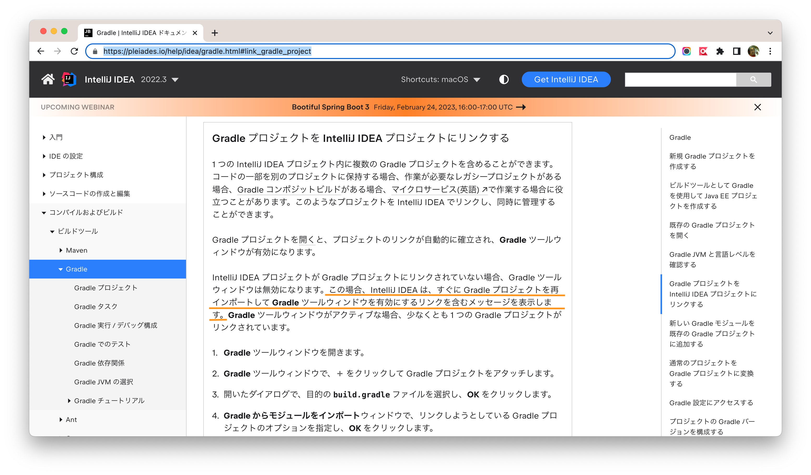
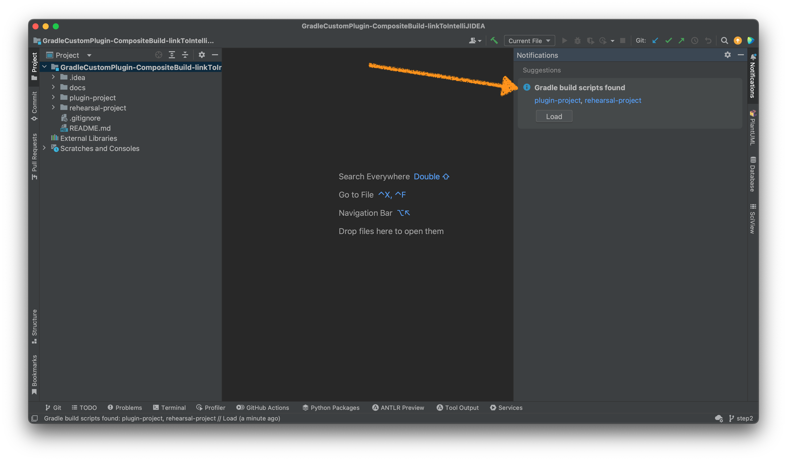
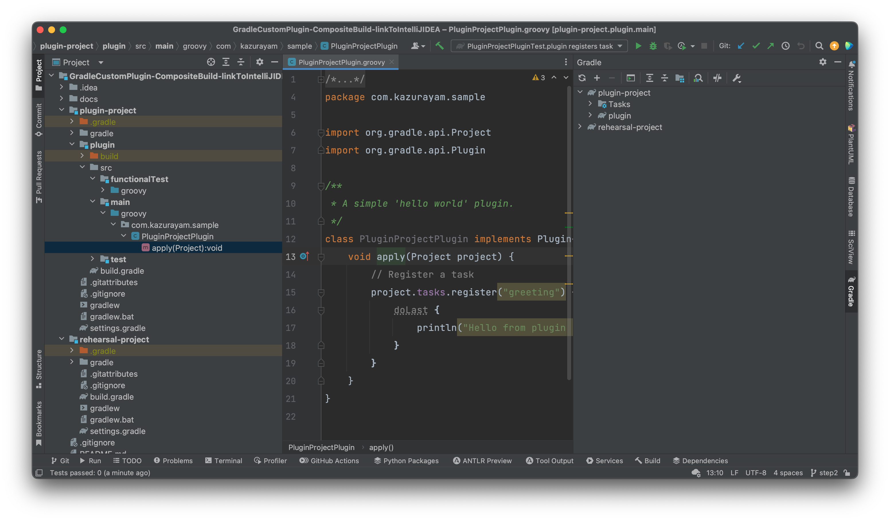

step2ブランチで作ったGradleプロジェクトをIntelliJ IDEAで開くにはどうすれば良いのか？IDEAのドキュメントに何か説明があるんじゃないか？と思った。これかな？

[quote]
____
1 つの IntelliJ IDEA プロジェクト内に複数の Gradle プロジェクトを含めることができます。コードの一部を別のプロジェクトに保持する場合、作業が必要なレガシープロジェクトがある場合、Gradle コンポジットビルドがある場合、マイクロサービス(英語)で作業する場合に役立つことがあります。このようなプロジェクトを IntelliJ IDEA でリンクし、同時に管理することができます。
____

おお、これだ。

[quote]
____

IntelliJ IDEA プロジェクトが Gradle プロジェクトにリンクされていない場合、Gradle ツールウィンドウは無効になります。この場合、IntelliJ IDEA は、すぐに Gradle プロジェクトを再インポートして Gradle ツールウィンドウを有効にするリンクを含むメッセージを表示します。
____

「メッセージを表示します」と書いてあるが、そんなメッセージ、本当に表示されたっけ？

`git checkout step2`とやって、IDEAで開いてみた。
メッセージなど見当たらない。

**５０秒間ぐらい放置していた。**

するとIDEAのウインドウがちょっと動いて、画面右側の領域にメッセージが表示された。

IDEAが

_「Gradleのビルド・スクリプトを見つけた」_

_「ロードするかい？」_

と訊ねている。ああ、ドキュメントに書いてあったメッセージとはこれだったのか！５０秒ぐらいも待たなければならかったから、今までわたしは気づかなかった。

Loadボタンを押した。数秒間IDEAが動いて少し様子が変わった。

いい感じだ。Projectツリーのなかでプログラムのソースコードが配置されたノードに青い四角いアイコンが表示されている。IDEAがclasspathを正しく認識しているらしい。画面右側にIDEAがGradleプロジェクトをどのように認識しているかが表示されて。そこを見ると `plugin-project` と `rehearsal-project` という2つのGradleプロジェクトが認識されてるのがわかる。

完全に動作するGradleプロジェクトを与えられたときIDEAが与えられたGradle build scriptを読み取り、解釈して、それと整合するようにIDEAのモジュールを適切に生成してくれたようだ。このときIDEAがProject Structureを目視してみたらこんなふうになっていた。

image::images/step4_4_Modules_loaded.png[]

違和感を覚えるところは見当たらない。たぶんこの設定が望ましいものなのだろう。
